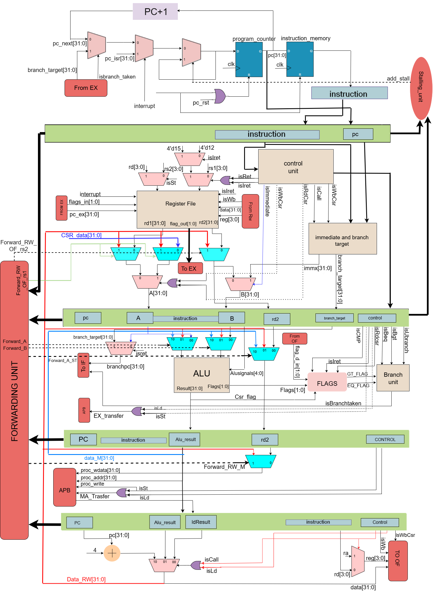

# SimpleRis SOC

---

## 1. Introduction

This document serves as the **official reference manual** for the **Simplerisc Processor and SoC**. It is intended for:

* New users trying to understand or program the processor
* RTL developers navigating the design
* Interviewers or reviewers evaluating the architecture

The document explains the system **from software-visible ISA down to pipeline-level microarchitecture**, followed by system control features such as CSRs, interrupts, and peripherals.

---

## 3. Instruction Set Architecture (ISA)

TinyRISC is a **32-bit RISC-style processor** with a compact instruction set optimized for embedded systems.

### 3.1 General Purpose Registers

| Feature             | Description                         |
| ------------------- | ----------------------------------- |
| Number of registers | 16                                  |
| Register width      | 32 bits                             |
| Register naming     | r0 – r15                            |
| Special usage       | r12 (return PC), r13 (flags backup) |

---

### 3.2 Instruction Set Overview

| Category      | Instructions                 |
| ------------- | ---------------------------- |
| Arithmetic    | add, sub, cmp                |
| Logical       | and, or, xor, not            |
| Shift         | lsl, lsr, asl, asr           |
| Data Movement | mov, ld, st                  |
| Control Flow  | b, beq, bgt, call, ret, iret |
| System        | nop, hlt                     |
| CSR           | csr mov                      |

---

## 4. Instruction Encoding Scheme

All instructions are **32 bits wide**.

### 4.1 Register Format

| Bits  | Field                     |
| ----- | ------------------------- |
| 31–27 | Opcode                    |
| 26    | Immediate flag (I)        |
| 25–22 | Destination register (rd) |
| 21–18 | Source register 1 (rs1)   |
| 17–14 | Source register 2 (rs2)   |

---

### 4.2 Immediate Format

| Bits  | Field                |
| ----- | -------------------- |
| 31–27 | Opcode               |
| 26    | Immediate flag       |
| 25–22 | Destination register |
| 21–18 | Source register      |
| 17–0  | Immediate value      |

Immediate modifiers:

* 00 – Signed lower immediate
* 01 – Unsigned lower immediate
* 10 – Upper immediate (shifted left by 16)

---

### 4.3 Branch Format

| Bits  | Field         |
| ----- | ------------- |
| 31–27 | Opcode        |
| 26–0  | Branch offset |

---

### 4.4 CSR Instruction Format

CSR operations are encoded using a special `mov` instruction variant.

| Bits  | Field                     |
| ----- | ------------------------- |
| 31–27 | Opcode                    |
| 26    | Immediate flag (always 1) |
| 25–22 | Destination register      |
| 21    | CSR mode                  |
| 20    | Read                      |
| 19    | Set                       |
| 18    | Clear                     |
| 17–16 | Modifier                  |
| 15–0  | Mask                      |

---

## 5. SoC and Processor Hierarchy

The TinyRISC SoC integrates the processor core, APB infrastructure, memory, and peripherals.

### 5.1 Top-Level Hierarchy (Simplified)

* SOC1

  * Processor Core

    * Fetch Cycle
    * Decode Cycle
    * Execute Cycle
    * Memory Cycle
    * Writeback Cycle
    * Data Hazard Unit
    * Data Hazard Stall Unit
    * Interrupt Handler
    * Control Status Registers (CSR)
    * Watchdog
  * APB Controller
  * APB Master
  * APB Slaves

    * Data Memory
    * UART
    * Timer
    * GPIO
    * PWM
    * SPI

---

## 6. Processor Pipeline Architecture

The TinyRISC processor uses a **5-stage in-order pipeline**:

1. Instruction Fetch (IF)
2. Operand Fetch / Decode (OF)
3. Execute (EX)
4. Memory Access (MA)
5. Write Back (WB)

### 6.1 Processor Core Block Diagram

---

## 7. Pipeline Stage Details

### 7.1 Instruction Fetch (IF)

* Program Counter management
* Branch redirection
* Interrupt redirection
* Instruction memory access
* IF–OF pipeline register

PC update priority:

1. Reset / Watchdog reset
2. Interrupt
3. Branch taken
4. Stall
5. Sequential execution

---

### 7.2 Operand Fetch / Decode (OF)

* Instruction decoding
* Register file read
* Immediate generation
* Control signal generation
* Early data forwarding

---

### 7.3 Execute (EX)

* ALU operations
* Flag generation (EQ, GT)
* Branch decision
* Branch target calculation

Branches are resolved in the EX stage. Taken branches flush earlier stages.

---

### 7.4 Memory Access (MA)

* Load/store execution
* APB transaction initiation
* Pipeline stalling during APB access
* Forwarding support

---

### 7.5 Write Back (WB)

* Result selection (ALU, memory, PC+1)
* Register file write

---

## 8. Hazard Management

### 8.1 Data Hazards

Handled using forwarding paths:

* EX → EX
* MEM → EX
* WB → EX / OF

### 8.2 Load-Use Hazard

* Detected by Data Hazard Stall Unit
* Single-cycle stall inserted

### 8.3 Control Hazards

* Branch resolved in EX stage
* Pipeline flushed on taken branch

---

## 9. Control Status Registers (CSR)

CSRs provide software control over system components.

### 9.1 CSR Map

| CSR Index | Function          |
| --------- | ----------------- |
| CSR[1]    | I2C Control       |
| CSR[2]    | SPI Control       |
| CSR[3]    | UART Control      |
| CSR[4]    | Watchdog Control  |
| CSR[5]    | Interrupt Control |

Only documented bits are writable; others are reserved.

---

### 9.2 Peripheral CSR Usage

#### UART CSR

* Enable transmitter/receiver
* Configure baud rate
* Enable UART interrupts

#### Timer CSR

* Enable timer
* Configure prescaler
* Enable timer interrupt

#### GPIO CSR

* Configure pin direction
* Read/write GPIO values

#### PWM CSR

* Configure duty cycle
* Configure period

---

## 10. Interrupt Controller

### 10.1 Interrupt Sources

* 8 interrupt sources total

  * 4 high priority
  * 4 low priority

### 10.2 Interrupt Behavior

* High priority interrupts preempt low priority
* Nested interrupts supported (depth = 2)
* Automatic pipeline flush on interrupt
* PC saved in r12
* Flags saved in r13

### 10.3 Interrupt Return

* `iret` restores processor state
* Global interrupt enables restored automatically

---

## 11. Watchdog Timer

* Monitors program counter activity
* Triggers processor reset if PC stalls
* Configurable via CSR[4]
* Prevents permanent hangs

---

## 12. How to Use TinyRISC (New User Guide)

1. Write assembly or compiler-generated code using the TinyRISC ISA
2. Configure peripherals using CSR instructions
3. Enable interrupts as required
4. Ensure watchdog is periodically refreshed (or disabled if not needed)
5. Use load/store instructions for peripheral access via APB

---

## 2. Reference Documents

The TinyRISC project is accompanied by three reference PDFs. Each document has a specific purpose and should be read in the following order:

### 2.1 TinyRISC Specification (`tinyrisc_spec.pdf`)

This document defines the **programmer’s view** of the processor.
It includes:

* Complete Instruction Set Architecture (ISA)
* Instruction opcodes and formats
* CSR definitions and bit fields
* Interrupt model and priority scheme
* APB protocol usage
* Peripheral programming model (UART, Timer, GPIO, PWM, SPI)

This is the **primary document for software development**.

### 2.2 TinyRISC Microarchitecture Documentation (`doc_tinyrisc.pdf`)

This document describes the **internal hardware implementation** of the processor.
It includes:

* Processor core block diagrams
* Five-stage pipeline explanation
* Hazard detection, forwarding, and stalling
* Interrupt pipeline interaction
* Watchdog and reset behavior

This is the **primary document for RTL understanding and debugging**.

### 2.3 Design Hierarchy (`Hierarchy.pdf`)

This document provides a **complete RTL module hierarchy** of the SoC.
It is useful for:

* Navigating the source code
* Understanding module instantiation
* Tracing signals across the design

This is the **primary document for RTL navigation**.

---
